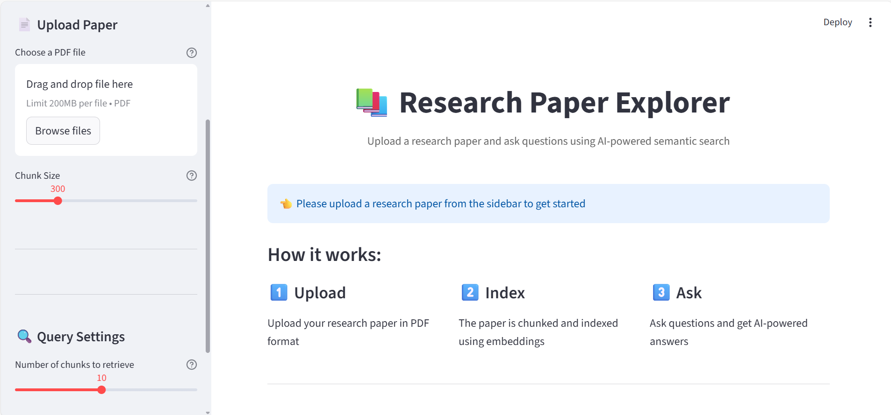
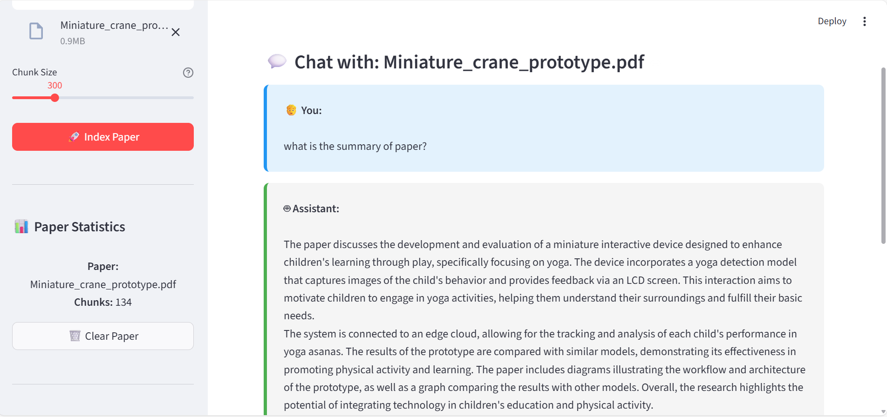

# Research Paper Explorer using ChromaDB and RAG📚

An interactive Streamlit application for exploring research papers using AI-powered semantic search and question-answering.

## Features

- 📄 **PDF Upload**: Upload research papers in PDF format
- 🔍 **Semantic Search**: Uses sentence transformers for intelligent text chunking and embedding
- 💾 **Persistent Storage**: ChromaDB for vector database storage
- 🤖 **AI-Powered Q&A**: GPT-4o-mini for generating accurate answers
- 💬 **Chat Interface**: Interactive conversation history
- 📊 **Statistics**: View paper metrics and chunk information

# 💬 Research Paper Explorer System Output



## Installation

### 1. Clone or download this repository
```
git clone https://github.com/harinimohan19/LLM_engineering_projects.git
cd .\LLM_engineering_projects\
cd .\Research_paper_explorer_RAG\
```

### 2. Install dependencies

```bash
pip install -r requirements.txt
```

### 3. Set up your OpenAI API key

Create a `.env` file in the project directory and add your OpenAI API key:

```
OPENAI_API_KEY=sk-your-actual-api-key-here
```

## Usage

### Running the Application

```bash
streamlit run research_paper_explorer_ui.py
```

The application will open in your default web browser at `http://localhost:8501`

### Using the Application

1. **Upload a Research Paper as PDF**
   - Select "📤 Upload PDF" in the sidebar
   - Click "Browse files"
   - Select a PDF research paper from your computer
   - Click "🚀 Index Paper"

2. **Ask Questions**
   - Type your question in the text input
   - Click "🔍 Ask Question"
   - View the AI-generated answer and source chunks

3. **Customize Settings**
   - Adjust chunk size for indexing (100-1000 characters)
   - Change number of chunks to retrieve (1-20)
   - Clear chat history or paper when needed

## Where to Find Research Papers

### Popular Open Access Sources

1. **arXiv.org** (Physics, Math, CS, etc.)

2. **bioRxiv** (Biology)

3. **PubMed Central**

4. **ResearchGate**


---

Built with ❤️ using Streamlit, OpenAI, and ChromaDB
